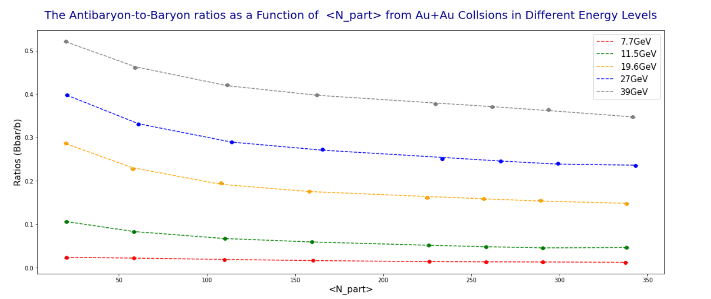

<link rel="stylesheet" href="styles.css" type="text/css">
<link rel="stylesheet" href="site_libs/academicons-1.9.1/css/academicons.min.css"/>

   

## **Strange Hadron Production in Au-Au Collisions**

 

   

### 1. Figure

[Fig.  The antibaryon-to-baryon ratios as a function of ⟨N_part⟩ from Au + Au collisions in different energy levels.]

 

  

### 2. Goal
To analyze the production of strange hadrons in Au-Au collisions by modeling the average transverse mass and antibaryon-to-baryon ratios, with the aim of identifying significant differences in data across different center-of-mass energies ranging from 7.7 to 39 GeV.

 

### 3. Methodology & Summary

  + We used polynomial model fitting to describe the trends in average transverse mass and antibaryon-to-baryon ratios for various energy levels. For hypothesis testing, we employed a two-sample t-test to analyze the antibaryon-to-baryon ratio and a one-way ANOVA test for the transverse mass. The results indicated significant differences in both variables at different energy levels, with p-values  0.003 and 0.01, respectively, rejecting the null hypotheses.
  + Our analysis revealed that higher energy levels result in an increased magnitude of both the antibaryon-to-baryon ratio and transverse mass. The best-fit model for the antibaryon-to-baryon ratio had an R-squared value of 0.9999 for the 11.5 GeV energy level, while the transverse mass model at 19.6 GeV also achieved an R-squared value of 0.9999. These findings suggest that there is a strong dependence of the produced hadron properties on the center-of-mass energy, contributing to our understanding of particle dynamics in heavy ion collisions.

 

### 4. Code

Please click [HERE](files/PHYS_267_Final_Project.pdf) for the analysis report and code.

 

