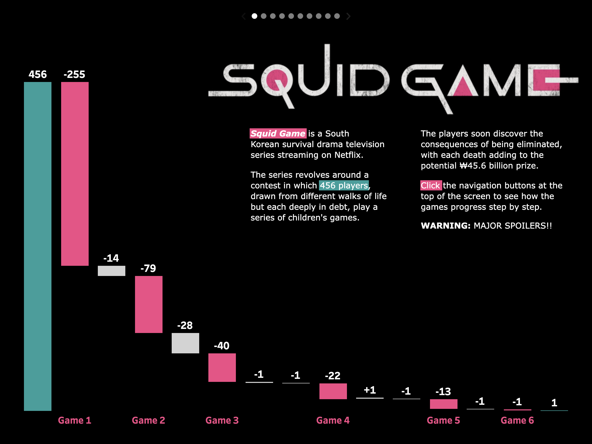

<link rel="stylesheet" href="styles.css" type="text/css">
<link rel="stylesheet" href="site_libs/academicons-1.9.1/css/academicons.min.css"/>

   

## **Squid Game Elimination Analysis**

 

🚨**THIS IS A FICTIONAL PROJECT MEANT AS AN EXAMPLE FOR THE STEPBYSTAT COMMUNITY.**

   

### 1. Screenshot of Dashboard

   

### 2. Summary

+ Squid Game is a South Korean survival drama television series streaming on Netflix.
+ The series runs a contest where 456 players, and all of them are in debt, thereby playing multiple different types of children's games.
+ The players soon realize that being eliminated means death, and prize money accrued as more and more people die.
+ Game 1 an extremely lethl version of Red Light, Green Light, where anyone caught moving is shot dead on the spot. It generated the most casualites, 255 people, as `elimination=death` rule was not informed to the players beforehand.

   

### 3. Tableau Public

For more insights, please check my Tableau Public by clicking [HERE](https://public.tableau.com/app/profile/davidhoskins/viz/SquidGameWARNINGMAJORSPOILERS/SquidGame).

